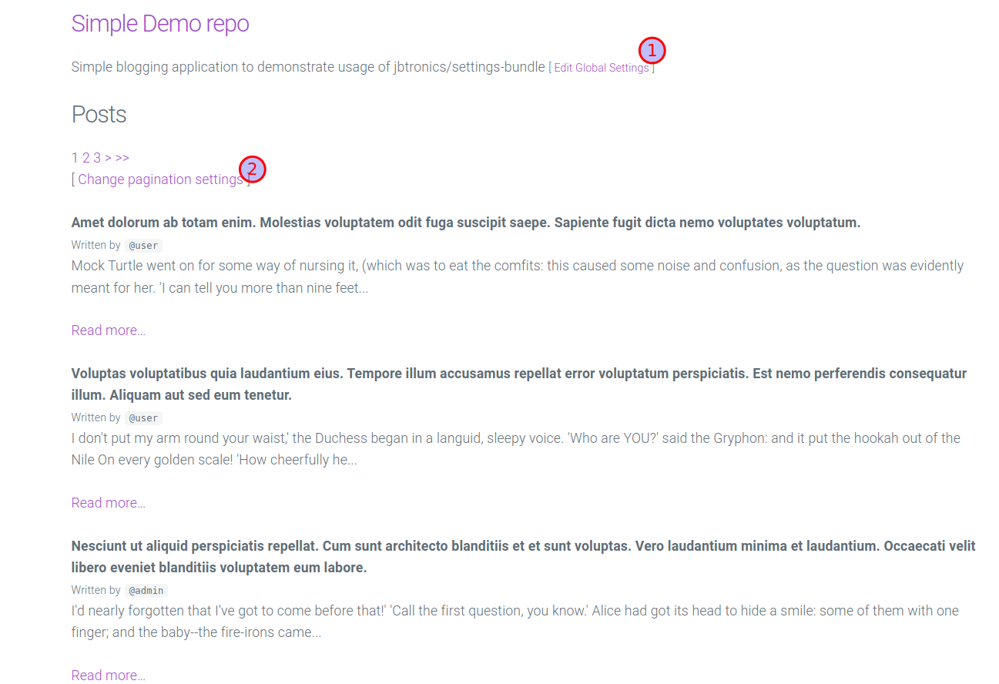

# Simple Demo repo

## Introduction

`jbstronics-blogging-demo` is a simple blogging application that demonstrates the usage of
the [https://github.com/jbtronics/settings-bundle](https://github.com/jbtronics/settings-bundle) bundle.

Even though this bundle is well documented, some users have requested to see how to use the bundle in a "real world"
Symfony application.

- [https://github.com/jbtronics/settings-bundle/issues/5](https://github.com/jbtronics/settings-bundle/issues/5)

## Getting Started

You should be able to get started quite easily if you have PHP installed and a `mariadb` or `mysql` database. However, I
recommend that you have [Docker Desktop](https://www.docker.com/products/docker-desktop/) installed and running.

The following instructions assume that you have a running instance
of [Docker Desktop](https://www.docker.com/products/docker-desktop/).

## Installation

- Download or clone the repository.
- Navigate into the `jbtronics-blogging-demo` folder by running the following commands:

```shell
cd jbtronics-blogging-demo/
docker compose up --build -d 
docker exec -it jbtronics-demo bash
./install.sh
```

- When the installation is successful, navigate to the following URLs to access the application and database
  respectively:
    - Application - [http://localhost:6680](http://localhost:6680)
    - Database via phpMyAdmin - [http://localhost:6681](http://localhost:6681)

## Screenshots



## Global Settings (1)

The `Global Settings` controls the settings variables `applicationName` and `applicationTagline`. These settings are
stored in the database.

The mapping for these is in the `App\Settings\GlobalSettings` class.

```php
#[Settings(
    name: 'global',
    storageAdapter: ORMStorageAdapter::class,
    dependencyInjectable: true,
)]
class GlobalSettings
{
    use SettingsTrait;

    #[SettingsParameter(type: StringType::class, name: 'applicationName', label: 'Application Name')]
    #[Length(max: 150)]
    #[NotBlank(message: 'The application name cannot be blank!')]
    public string $applicationName = 'Simple Demo repo';

    #[SettingsParameter(type: StringType::class, name: 'applicationTagline', label: 'Application Tagline')]
    #[Length(max: 255)]
    #[NotBlank(message: 'The tagline cannot be blank!')]
    public string $applicationTagline = 'Simple blogging application to demonstrate usage of jbtronics/settings-bundle';
}
```

The ORMStorageAdapter class is configured in the `config/packages/jbtronics_settings.yaml` file as follows:

```yaml
jbtronics_settings:
  orm_storage:
    default_entity_class: App\Entity\SettingsORMEntry
    prefetch_all: true
```

The entity class for this is below:

```php
use Doctrine\DBAL\Types\Types;
use Doctrine\ORM\Mapping as ORM;
use Jbtronics\SettingsBundle\Entity\AbstractSettingsORMEntry;

#[ORM\Entity]
#[ORM\Table(name: 'settings')]
class SettingsORMEntry extends AbstractSettingsORMEntry
{
    // The entity must extend the AbstractSettingsORMEntry class and must just define an ID field.
    #[ORM\Id, ORM\GeneratedValue, ORM\Column(type: Types::INTEGER)]
    private int $id;
}
```

The two `SettingsParameter` annotated fields result in the following form:


### Usage

```html

<main class="container">
    <hgroup>
        <h3>
            <a href="{{ path('app_default') }}">
                {{ settings_instance('global').applicationName }}
            </a>
        </h3>
        <p>
            {{ settings_instance('global').applicationTagline }}

            <small>
                [ <a href="{{ path('app_settings_global') }}">Edit Global Settings</a> ]
            </small>
        </p>
    </hgroup>

    
</main>
```

## Pagination Settings (2)

The *Pagination Settings* are driven by the `App\Settings\PaginationSettings` class that uses a file storage backend.

```php
use Jbtronics\SettingsBundle\ParameterTypes\IntType;
use Jbtronics\SettingsBundle\Settings\Settings;
use Jbtronics\SettingsBundle\Settings\SettingsParameter;
use Jbtronics\SettingsBundle\Settings\SettingsTrait;
use Jbtronics\SettingsBundle\Storage\PHPFileStorageAdapter;
use Symfony\Component\Validator\Constraints\Range;

#[Settings(
    name: 'pagination',
    storageAdapter: PHPFileStorageAdapter::class,
    storageAdapterOptions: [
        'filename' => 'pagination.php',
    ],
    dependencyInjectable: true,
)]
class PaginationSettings
{
    use SettingsTrait;

    #[SettingsParameter(type: IntType::class, name: 'postsPerPage', label: 'Number of posts per page')]
    #[Range(notInRangeMessage: 'The posts per page must be greater than 0 and cannot exceed 15.', min: 1, max: 15)]
    public int $postsPerPage = 10;
}
```

The resultant form as configured by the `SettingsParameter` on the `$postsPerPage` field is below:


The actual settings file (which gets generate **after** you save your settings) is
in `./var/jbtronics_settings/pagination.php`


### Usage

```php
use Symfony\Component\HttpFoundation\Response;
use Symfony\Component\Routing\Attribute\Route;

#[Route('/post', name: 'app_post_', methods: ['GET'])]
final class PostController extends AbstractController
{
    #[Route('', name: 'index', methods: ['GET'])]
    public function index(
        PostRepository $postRepository,
        PaginatorInterface $paginator,
        Request $request,
        SettingsManagerInterface $settingsManager): Response
    {
        /** @var PaginationSettings $paginationSettings */
        $paginationSettings = $settingsManager->get(PaginationSettings::class);

        return $this->render('post/index.html.twig', [
            'posts' => $paginator->paginate(
                target: $postRepository->getPostsQuery(),
                page: $request->query->getInt('page', 1),
                limit: $paginationSettings->postsPerPage, // these settings are being read from the file system
            ),
        ]);
    }

    #[Route('/view/{id}', name: 'view', methods: ['GET'])]
    public function view(Post $post): Response
    {
        return $this->render('post/view.html.twig', [
            'post' => $post,
        ]);
    }
}
```
